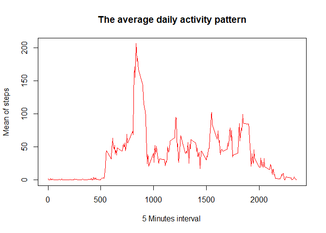
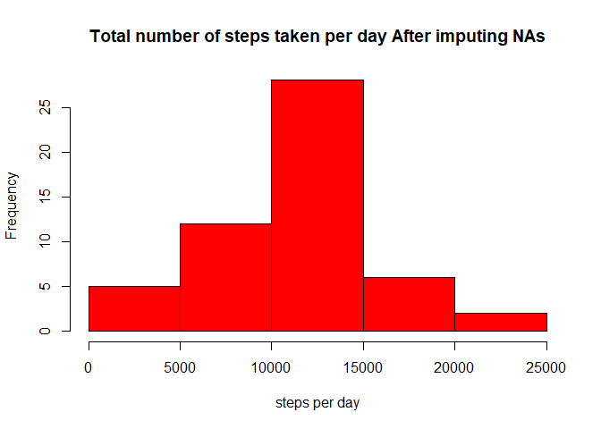
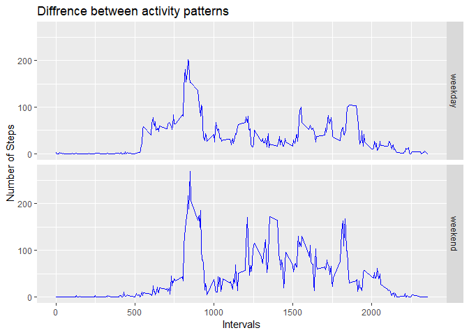

## Set Global options 


```r
knitr::opts_chunk$set(echo=TRUE)
library(dplyr)    
```

```
## 
## Attaching package: 'dplyr'
```

```
## The following objects are masked from 'package:stats':
## 
##     filter, lag
```

```
## The following objects are masked from 'package:base':
## 
##     intersect, setdiff, setequal, union
```

```r
library(ggplot2)
```


## Loading and preprocessing the data

##### Firstly we will set the working directory 

```r
setwd("D:/Courses/DataScienceSpecialization/5- Reproducible research/RepData_PeerAssessment1-master")
```

##### Then we will check and load data 

```r
if(!file.exists("activity.csv")) {
        myFile <- tempfile()
        download.file("http://d396qusza40orc.cloudfront.net/repdata%2Fdata%2Factivity.zip",destfile = myFile)
        unzip(myFile)
        unlink(myFile)
}

dataset <- read.csv("activity.csv") 
```

##### Let's Explore the data set 

```r
summary(dataset)
```

```
##      steps                date          interval     
##  Min.   :  0.00   2012-10-01:  288   Min.   :   0.0  
##  1st Qu.:  0.00   2012-10-02:  288   1st Qu.: 588.8  
##  Median :  0.00   2012-10-03:  288   Median :1177.5  
##  Mean   : 37.38   2012-10-04:  288   Mean   :1177.5  
##  3rd Qu.: 12.00   2012-10-05:  288   3rd Qu.:1766.2  
##  Max.   :806.00   2012-10-06:  288   Max.   :2355.0  
##  NA's   :2304     (Other)   :15840
```
## What is mean total number of steps taken per day?
##### Let's aggregate per day 


```r
stepsPerDay <- aggregate(steps ~ date , data = dataset, FUN = sum)
```

##### Then we need to plot the hist for the total number of steps taken per day


```r
hist(stepsPerDay$steps, xlab = "steps per day" , main = "Total number of steps taken per day", col = "red")
```

<!-- -->

##### Then we need to Calculate and report the mean and median total number of steps taken per day

```r
mean_steps <- format(mean(stepsPerDay$steps),digits = 1)
median_steps <- format(median(stepsPerDay$steps),digits = 1) 
```
The **mean** of total steps per day is  **10766** and the **median** for it is **10765**

## What is the average daily activity pattern?
##### 1. Make a time series plot (i.e. type = "l") of the 5-minute interval (x-axis) and the average number of steps taken, averaged across all days (y-axis) 


```r
stepsmean_interval<- aggregate(steps ~ interval , data = dataset, FUN = mean, na.rm = TRUE)
```
##### Let's plot it 

```r
plot(stepsmean_interval$interval, stepsmean_interval$steps, type ="l" ,xlab = "5 Minutes interval ", ylab="Mean of steps", main = "The average daily activity pattern", col= "red")
```

<!-- -->

##### 2. Which 5-minute interval, on average across all the days in the dataset, contains the maximum number of steps?


```r
max_steps <- max(stepsmean_interval$steps)
max_interval <- stepsmean_interval$interval[which(stepsmean_interval$steps == max_steps)]
```

The maximum interval is **835**


## Imputing missing values
1. Calculate and report the total number of missing values in the dataset (i.e. the total number of rows with NAs) 


```r
totalNA <- sum(is.na(dataset))
```

The total number of NAs in the dataset is **2304** 

2. Devise a strategy for filling in all of the missing values in the dataset. The strategy does not need to be sophisticated. For example, you could use the mean/median for that day, or the mean for that 5-minute interval, etc.


```r
dataset_NA <- dataset[is.na(dataset$steps),]
dataset_Non_NA <- dataset[!is.na(dataset$steps),]
dataset_NA$steps <- as.factor(dataset_NA$interval)
levels(dataset_NA$steps) <- stepsmean_interval
levels(dataset_NA$steps) <- round(as.numeric(levels(dataset_NA$steps)))
```

```
## Warning: NAs introduced by coercion
```

```r
dataset_NA$steps <- as.integer(as.vector(dataset_NA$steps))
```


3. Create a new dataset that is equal to the original dataset but with the missing data filled in.

```r
new_dataset <- rbind(dataset_NA, dataset_Non_NA)
```

4. Make a histogram of the total number of steps taken each day and Calculate and report the mean and median total number of steps taken per day. Do these values differ from the estimates from the first part of the assignment? What is the impact of imputing missing data on the estimates of the total daily number of steps?

##### Let's aggregate the new dataset per day 


```r
new_stepsPerDay <- aggregate(steps ~ date , data = new_dataset, FUN = sum)
```

##### Then we need to plot the hist for the total number of steps taken per day


```r
hist(new_stepsPerDay$steps, xlab = "steps per day" , main = "Total number of steps taken per day After imputing NAs", col = "red")
```

<!-- -->

##### Calculate and report the mean and median total number of steps taken per day


```r
new_mean_steps <- format(mean(new_stepsPerDay$steps),digits = 1)
new_median_steps <- format(median(new_stepsPerDay$steps),digits = 1) 
```

The **mean** of total steps per day is  **10766** and the **median** for it is **10765**

**Imputing missing values didn't change the mean and median Values**

## Are there differences in activity patterns between weekdays and weekends?
##### Firstly we need to categorize data to include day name 

```r
new_dataset$dayName <- ifelse(weekdays(as.Date(new_dataset$date), abbreviate = F) == "Friday" | weekdays(as.Date(new_dataset$date)) == "Saturday", "weekend", "weekday")
steps_interval_dayName <- aggregate(steps ~ interval + dayName, data = new_dataset, FUN = mean)

names(steps_interval_dayName) <- c("interval", "day_Name", "mean_steps")
plot <- ggplot(steps_interval_dayName, aes(interval, mean_steps))
plot + geom_line(color = "blue") + facet_grid(day_Name~.) + labs(x = "Intervals", y = "Number of Steps", title = "Diffrence between activity patterns")
```

<!-- -->


